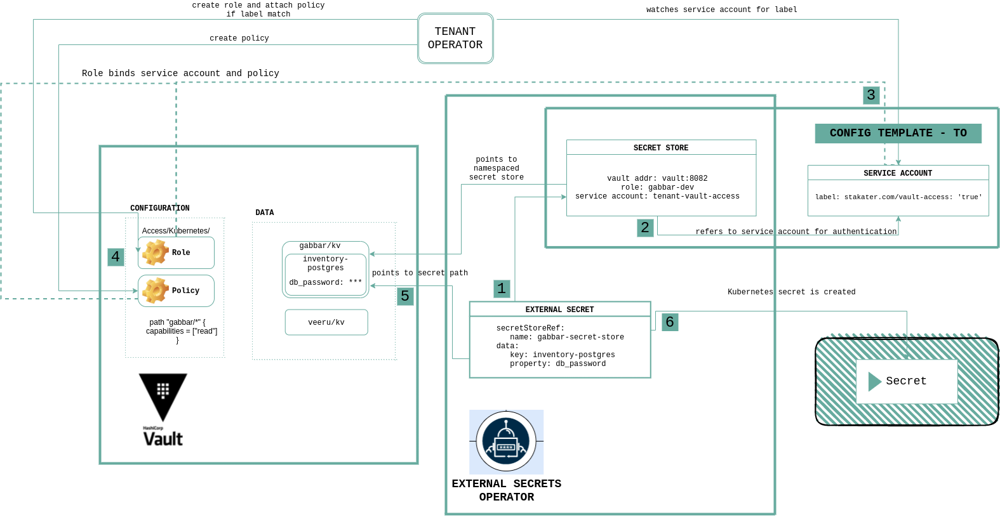

# External Secret Operator Workflow

This diagram explains how Multi Tenant Operator works together with Vault and External Secrets Operator:

## Workflow

### Step 1

In `externalSecret` we define details of secrets available in Vault and secret store that reference Vault connection and authentication details.

### Step 2

Secret Store `tenant-vault-secret-store` is already created in each namespace by Multi Tenant Operator templates. It refers to service account `tenant-vault-access` for authentication. Secret Store also refers to Vault `role` created with the same name as namespace name by Multi Tenant Operator.

### Step 3

Service account `tenant-vault-access` being referred by `SecretStore` is already created by Multi Tenant Operator templates. This service account has the `stakater.com/vault-access: 'true'` label, which is used to bound it with the Vault `role` by Multi Tenant Operator. To learn how Multi Tenant Operator authenticates with Vault, see [Vault Multitenancy](https://docs.stakater.com/mto/latest/how-to-guides/enabling-multi-tenancy-vault.html).

### Step 4

Vault verifies if the defined service account has access to `role` and `role` has an attached `policy` that grants access to requested path.

### Step 5

After authentication is successful, external secrets get data from the path requested from Vault.

### Step 6

Kubernetes secret is created from the values stored in Vault.
