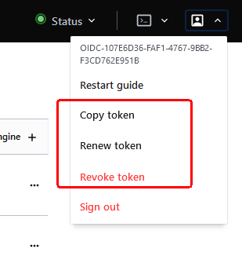

# HashiCorp Vault

HashiCorp Vault is a tool for securely managing secrets. A secret is anything that you want to tightly control access to, such as API keys, passwords, or certificates. Vault provides a unified interface to any secret, while providing tight access control and recording a detailed audit log.

When you create a secret in Kubernetes it is stored in `etcd` as plain text, and the secret is also accessible to anyone that has access to your cluster. Vault solves this issue by providing a central secret management store that provides an additional layer of security using its authentication methods. Secrets are only accessible when you provide a corresponding authentication token.

There are two kinds of secrets stored in Vault for SAAP:

* Secrets for managed applications provided by Stakater, such as Nexus repository credential:
    * Users only have read permissions
    * The Vault path is `managed-addons/*`
* Tenant specific secrets:
    * A `KV` v2 secret engine is enabled on the `TENANT_NAME/kv` path by default
    * Users can enable/disable secret engines on `TENANT_NAME/*` paths and create/delete/update/read secrets through them

Users can manage secrets via Vault UI or Vault CLI.

## Manage Vault secrets via UI

Users included in any tenants can access the Vault UI using OIDC authentication.

Once logged in, users can do all actions on the path `TENANT_NAME/*`:

* Enable/disable any kinds of secret engines
* Create/update/get/list/delete secrets

### Authentication

To log in to Vault via the UI:

1. Access Vault via Forecastle or `https://stakater-vault-openshift-stakater-vault.CLUSTER_DOMAIN`
1. Select the `OIDC` method
1. Keep `Role` as `Default`
1. Click `Sign in with OIDC Provider`:

    

1. A login dialogue will pop up. The browser needs to allow popup dialogues:

    

### Enable secret engines

To enable a secrets engine:

1. Click on the Secrets tab

1. Under Secrets Engines, select `Enable new engine`:

    

1. Select an engine and click next:

    

### Create secrets

To create a secret:

1. Click on your `TENANT/kv` path
1. Click on the `Create Secret` button:

    

1. Provide key-value pair to add secret:

    

## Manage Vault secrets via CLI

To use the Vault CLI, a token is required. Users can get/renew/revoke a token from the UI:

1. Click on the user account:

    

1. Once a token is fetched, users can use the terminal provided by the UI, so there is no need to install the Vault CLI:

    

1. If using the Vault CLI, login with the token:

    ```bash
    vault login token=${TOKEN}
    ```

## Consume Vault secrets

SAAP supports 3 different ways to consume secrets from Vault:

* Option 1 (Recommended): Consume Vault secret via ExternalSecret
* Option 2: Consume Vault secret via a Volume
* Option 3: Consume Vault secret via Environment Variable

Below you can find step-by-step guides to consume secrets via the different options.

### Option 1: Consume Vault secret via ExternalSecret

Kubernetes secret by default do not support storing or retrieving secret data from external secret management systems such as Vault. _External Secrets_ solves this problem by providing access to secrets stored externally. It does this by adding an `ExternalSecret` object to Kubernetes using a [`CustomResourceDefinition`](https://kubernetes.io/docs/concepts/extend-kubernetes/api-extension/custom-resources/).

SAAP comes with fully managed [_External Secrets Operator_](https://github.com/external-secrets/external-secrets/) to integrate with Vault and makes it extremely easy to consume secrets from Vault:

1. Add `tenant-vault-access` template to the tenant:

    ```yaml
    apiVersion: tenantoperator.stakater.com/v1alpha1
    kind: Tenant
    metadata:
      name: gabbar
    spec:
      users:
        owner:
        - user1
        - user2
      quota: medium
      namespacetemplate:
        templateInstances:
        - spec:
            template: tenant-vault-access
            sync: true
    ```

1. Enable `externalSecret` in your `deploy/values.yaml` and provide details of the secret path in Vault:

    ```yaml
    externalSecret:
      enabled: true
      secretStore:
        name: tenant-vault-secret-store
      files:   
      inventory-postgres: #Name of Kubernetes Secret
        data:
          postgresql-password: #Name of Kubernetes Secret Key
            remoteRef:
              key: inventory-postgres #Name of Vault Secret
              property: postgresql-password #Name of Vault Secret Key
    ```

When a secret is updated in Vault, the pod is automatically restarted by Reloader.

### Option 2: Consume Vault secret via a Volume

To mount Vault secret in a volume do the following:

1. Add label in `serviceAccount` so it can be granted Vault read access to secret path:

     ```yaml
      serviceAccount:
        enabled: true
        additionalLabels: 
          stakater.com/vault-access: "true"
     ```

1. Enable `SecretProviderClass` object in Helm values and define key and value path of Vault:

     ```yaml
     secretProviderClass:
      enabled: true
      name: postgres-secret
      roleName: '{{.Release.Namespace}}'
      objects: 
        - objectName: postgresql-password
          secretPath: gabbar/data/postgres
          secretKey: postgresql-password
     ```

1. Define volume in Helm values that use above created `SecretProviderClass`:
  
     ```yaml
     deployment:
       volumes: 
         - name: postgres-secret
           csi:
             driver: secrets-store.csi.k8s.io
             readOnly: true
             volumeAttributes:
               secretProviderClass: postgres-secret
     ```

1. Mount this volume in the container:

     ```yaml
     volumeMounts:
     - name: postgres-secret
       readOnly: true
       mountPath: /data/db-creds
     ```

### Option 3: Consume Vault secret via Environment Variable

To mount Vault secret in an environment variable:

1. Enable `SecretProviderClass` object in Helm values and define key/value path and secret objects in Vault:

     ```yaml
     secretProviderClass:
      enabled: true
      name: postgres-secret
      roleName: '{{.Release.Namespace}}'
      objects: 
        - objectName: postgresql-password
          secretPath: gabbar/data/postgres
          secretKey: postgresql-password
      secretObjects:
        - data:
          - key: postgres-password
            objectName: postgresql-password
          secretName: postgres-secret
          type: Opaque 
     ```

   The value of `secretName` will be the name of the Kubernetes secret.

1. Define volume in Helm values that use above created `SecretProviderClass`:
  
     ```yaml
     deployment:
       volumes: 
         - name: postgres-secret
           csi:
             driver: secrets-store.csi.k8s.io
             readOnly: true
             volumeAttributes:
               secretProviderClass: postgres-secret
     ```

1. Mount this volume in the container:
  
     ```yaml
     volumeMounts:
     - name: postgres-secret
       readOnly: true
       mountPath: /data/db-creds
     ```
  
    Volume mount is required in order to create a Kubernetes secret.

1. This secret can be used as an environment variable:

     ```yaml
     env:
        - name: POSTGRES_PASSWORD
          valueFrom:
             secretKeyRef:
                 name: postgres-secret
                 key: postgres-password
     ```

[Here](https://github.com/stakater-lab/stakater-nordmart-review/blob/main/deploy/values.yaml#L24) is a working example.

Your secret should be available at the path defined above in Vault; a change in secret value in Vault will automatically restart the application by [Stakater Reloader](https://github.com/stakater/Reloader).
